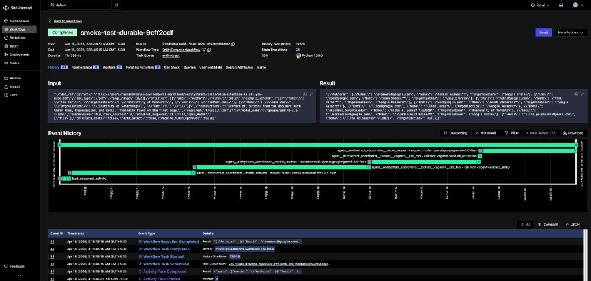
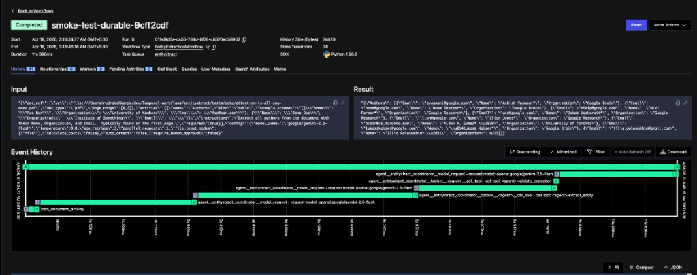

# entityxtract

[](https://github.com/astral-sh/uv)
[](https://github.com/astral-sh/ruff)
[](https://pydantic.dev)
[](https://www.python.org/downloads/)
[](https://opensource.org/licenses/MIT)

**Entity-first, schema-driven extraction of structured data from unstructured documents** (PDF, DOCX, TXT, images). Define custom entities with schemas, few-shot examples, and instructions, then extract reliably using any local or SOTA LLM.

Built as an **open-source alternative** to Google Cloud Document AI, Azure AI Document Intelligence, and Adobe PDF Extract — but provider-agnostic and designed to work with any LLM.

<p align="center">
  <a href="https://github.com/Prathamesh-Ghatole/entityxtract">
    
  </a>
</p>


## Features

* 🎯 **Entity-first extraction** — Smart structured data extraction with pre-defined / auto-identified entities.
* 📄 **Multiple document formats** — Support for PDF, TXT, MD, and images.
* 🔀 **Smart input modes** — Extract information using text, OCR, or hybrid approaches.
* 🌐 **Provider-agnostic design** — Works with any LLM via OpenAI-compatible APIs.
* 🔄 **Robust execution** — Built-in retries, parallel extraction, strictly structured and typed output.
* 📊 **Observability** — Structured logs, token usage tracking, and optional cost tracking.
* 📦 **PyPI Package** — Easily install and use entityxtract in your projects.

<details>
<summary><b>▶ Coming Soon — click to expand upcoming features</b></summary>

<br>

* 🌐 **FastAPI REST API** for remote extraction services.
* 🖥️ **Web UI** for visual entity/schema management and job monitoring.
* 🔍 **Auto-detect mode** to automatically identify extractable entities in documents.
* 💰 **Cost Optimization** using PDF annotation caching, and smart input data pruning.
* 👁️ **Deepseek OCR** integration for enhanced document processing.
* 🔌 **MCP server** for agentic applications.

</details>

## Installation

<details>
<summary><b>▶ Click to expand — install with uv (recommended)</b></summary>

<br>

To use entityxtract, you'll need Python 3.12+ and [uv](https://docs.astral.sh/uv/) (recommended):

```bash
# Install uv if you haven't already
curl -LsSf https://astral.sh/uv/install.sh | sh

# Clone the repository
git clone https://github.com/Prathamesh-Ghatole/entityxtract.git
cd entityxtract

# Install dependencies
uv sync
```

</details>

## Getting Started

<details open>
<summary><b>▼ Click to collapse — extract pre-defined entities in 4 steps</b></summary>

<br>

Extract pre-defined entities:

```python
from pathlib import Path
import polars as pl
from entityxtract.extractor_types import (
    Document, TableToExtract,
    ExtractionConfig, FileInputMode
)
from entityxtract.extractor import extract_objects

# 1. Load your document
doc = Document(Path("document.pdf"))

# 2. Define what to extract
table = TableToExtract(
    name="Events",
    example_table=pl.DataFrame([
        {"Time": "02:05", "Type": "Operation", "Description": "Example event"},
        {"Time": "03:25", "Type": "Transit", "Description": "Another event"}
    ]),
    instructions="Extract the events table with Time, Type, and Description columns.",
    required=True
)

# 3. Configure extraction
config = ExtractionConfig(
    model_name="google/gemini-2.5-flash",  # Recommended
    temperature=0.0,
    file_input_modes=[FileInputMode.FILE]
)

# 4. Extract!
results = extract_objects(doc, [table], config)

# Use your results
for name, result in results.results.items():
    if result.success:
        df = pl.DataFrame(result.extracted_data)
        print(df)
    else:
        print(f"Failed: {result.message}")
```

</details>

## Configuration

<details>
<summary><b>▶ Click to expand — environment variables for any OpenAI-compatible endpoint</b></summary>

<br>

Copy the sample environment file `.env.sample` to `.env`, or set the following environment variables directly:

```bash
# For all OpenAI-compatible endpoints [OpenAI, OpenRouter, Ollama, lm-studio, etc.]
export OPENAI_API_KEY="your-api-key"
export OPENAI_API_BASE="https://openrouter.ai/api/v1"

# Default model
export OPENAI_DEFAULT_MODEL="google/gemini-2.5-flash"
```

</details>

## Usage Examples

<details>
<summary><b>▶ Click to expand — multi-entity extraction, cost tracking, and input modes</b></summary>

<br>

### Complete Example with Multiple Entities

```python
from pathlib import Path
import polars as pl

from entityxtract.extractor_types import (
    Document, ExtractionConfig, FileInputMode,
    TableToExtract, StringToExtract
)
from entityxtract.extractor import extract_objects

# Load document
doc = Document(Path("reports/quarterly_summary.pdf"))

# Define entities to extract
table = TableToExtract(
    name="Financial Summary",
    example_table=pl.DataFrame([
        {"Quarter": "Q1 2024", "Revenue": "$1.2M", "Expenses": "$800K", "Profit": "$400K"},
        {"Quarter": "Q2 2024", "Revenue": "$1.5M", "Expenses": "$900K", "Profit": "$600K"}
    ]),
    instructions="Extract the quarterly financial summary table with Quarter, Revenue, Expenses, and Profit columns.",
    required=True
)

report_id = StringToExtract(
    name="Report ID",
    example_string="RPT-2024-Q2-001",
    instructions="Extract the report identifier from the document header.",
    required=False
)

# Configure extraction with cost tracking
config = ExtractionConfig(
    model_name="google/gemini-2.5-flash",
    temperature=0.0,
    file_input_modes=[FileInputMode.FILE],
    parallel_requests=4,
    calculate_costs=True
)

# Run extraction
results = extract_objects(doc, [table, report_id], config)

# Process results
for name, res in results.results.items():
    if res.success:
        print(f"✓ [{name}] extracted successfully")
        print(f"  Tokens: {res.input_tokens} in / {res.output_tokens} out")
        print(f"  Cost: ${res.cost:.4f}")
        
        # Export table to CSV
        if isinstance(res.extracted_data, list):
            df = pl.DataFrame(res.extracted_data)
            df.write_csv(f"{name}.csv")
            print(f"  Saved to {name}.csv")
    else:
        print(f"✗ [{name}] failed: {res.message}")

print(f"\nTotals: {results.total_input_tokens} tokens in, {results.total_output_tokens} tokens out")
print(f"Total cost: ${results.total_cost:.4f}")
```

### Different Input Modes

```python
# Pass document as file attachment
config = ExtractionConfig(
    model_name="google/gemini-2.5-flash",
    file_input_modes=[FileInputMode.FILE]
)

# Pass document as text content
config = ExtractionConfig(
    model_name="google/gemini-2.5-flash",
    file_input_modes=[FileInputMode.TEXT]
)

# Pass document as images (useful for scanned documents)
config = ExtractionConfig(
    model_name="google/gemini-2.5-flash",
    file_input_modes=[FileInputMode.IMAGE]
)

# Combine multiple input modes
config = ExtractionConfig(
    model_name="google/gemini-2.5-flash",
    file_input_modes=[FileInputMode.FILE, FileInputMode.TEXT]
)
```

See `tests/test.py` for more complete examples.

</details>

## Durable & Agentic Extraction (Temporal)

entityxtract ships with an optional **[Temporal](https://temporal.io/)** integration that makes extraction jobs crash-proof, resumable, and agentic. Built on [Pydantic AI](https://ai.pydantic.dev/) and Temporal, it wraps the same extraction logic in durable workflows so worker crashes, rate limits, and transient errors don't force you to re-pay for tokens.

<details>
<summary><b>▶ Click to expand — full Temporal setup, usage, architecture, and UI walkthrough</b></summary>

### What you get

- **Crash-proof** — if the worker dies mid-extraction, restarting it resumes where it left off. Completed LLM calls are not re-paid.
- **Automatic retries** — Temporal's retry policies replace manual backoff loops; rate limits and transient failures are handled per-activity.
- **Agentic coordinator** — a Pydantic AI agent (`TemporalAgent`) orchestrates extraction, validates results, and self-corrects with refined prompts.
- **Human-in-the-loop** — signal-based approval/rejection of extracted entities, with a 24-hour auto-approval timeout.
- **Progress queries** — query a running workflow for real-time progress and partial results.
- **Full observability** — every LLM call and tool invocation is recorded in Temporal's event history (see screenshots below).

### Prerequisites

1. **Install Temporal CLI**:

   ```bash
   brew install temporal        # macOS
   # or see https://docs.temporal.io/cli for other platforms
   ```

2. **Configure `entityxtract/.env`** with an OpenAI-compatible endpoint:

   ```bash
   OPENAI_API_KEY="sk-or-v1-..."
   OPENAI_API_BASE="https://openrouter.ai/api/v1"
   OPENAI_DEFAULT_MODEL="google/gemini-2.5-flash"
   ```

   Any OpenAI-compatible endpoint works (OpenAI, OpenRouter, Ollama, Together, Groq, LM Studio, etc.).

### Quick start

```bash
# Terminal A — Temporal dev server (UI at http://localhost:8233)
temporal server start-dev

# Terminal B — entityxtract worker
python -m entityxtract.durable.worker
# Expect:
#   Coordinator model: openai:google/gemini-2.5-flash
#   Coordinator activities: ['event_stream_handler_activity', 'request_activity', ...]
#   Worker listening on task queue 'entityxtract'...

# Terminal C — run an end-to-end smoke test against the included PDF
python scripts/smoke_test_durable.py
```

### Programmatic usage

```python
import asyncio
import json
from entityxtract.durable import (
    DocumentRef, EntitySpec, ExtractionJobRequest, run_extraction_job,
)
from entityxtract.extractor_types import ExtractionConfig, FileInputMode

request = ExtractionJobRequest(
    doc_ref=DocumentRef(uri="file:///path/to/report.pdf", doc_type="pdf"),
    entities=[
        EntitySpec(
            name="Authors",
            kind="table",
            example_schema=json.dumps([{"Name": "Example", "Org": "Example Inc"}]),
            instructions="Extract all authors with Name and Organization.",
        ),
    ],
    config=ExtractionConfig(
        model_name="google/gemini-2.5-flash",
        file_input_modes=[FileInputMode.FILE],
    ),
)

results = asyncio.run(run_extraction_job(request, workflow_id="my-report"))
print(results)
```

### Architecture

```
Client  ──start workflow──>  Temporal Server  <──schedule/persist──>  Worker
                                                                       │
                                                     ┌─────────────────┤
                                                     │ Workflow         │
                                                     │ (deterministic)  │
                                                     │                  │
                                                     ▼                  ▼
                                              TemporalAgent      Activities
                                              (coordinator)     load_document
                                                   │            render_pages
                                                   ▼            extract_entity
                                              Model Activity    validate
                                              (LLM call)
```

The workflow stays deterministic (just orchestration). Every non-deterministic operation — LLM calls, PDF parsing, file I/O, tool invocations — lives in a Temporal activity with its own retry policy, timeout, and durability guarantees.

### Temporal UI walkthrough

After running the smoke test, open **http://localhost:8233** and click the completed workflow run. You'll see something like:

<p align="center">
  
</p>

The **top panel** shows workflow metadata (status, start/end times, task queue, history size, SDK version). The **Input** box is the serialized `ExtractionJobRequest`; the **Result** box is the extracted entities returned to the client.

Zooming into the **Event History** timeline gives you the per-activity durability view:

<p align="center">
  
</p>

Each bar is a Temporal activity. Reading left-to-right:

- `load_document_activity` — loads the PDF (runs once, no retries needed).
- `agent_entityxtract_coordinator_model_request` (the long green bars) — one LLM call each. These are the auto-generated activities from `TemporalAgent`.
- `agent_entityxtract_coordinator_toolset_<agent>_call_tool` — each tool invocation the coordinator decides to make (`extract_entity`, `validate_extraction`).

If the worker had crashed at any point, Temporal would have replayed history up to the last completed activity and resumed — none of the completed bars would run again.

### Signals & Queries

| Type   | Name                  | Description                                    |
|--------|-----------------------|------------------------------------------------|
| Signal | `approve_entity`      | Approve an extracted entity (optionally edit)  |
| Signal | `reject_entity`       | Reject an entity with a reason                 |
| Query  | `get_progress`        | Get current `JobProgress` snapshot             |
| Query  | `get_partial_results` | Get completed extraction results so far        |

Send signals / run queries from the Temporal UI, the `temporal` CLI, or programmatically via `entityxtract.durable.client`.

### File layout

```
src/entityxtract/durable/
  __init__.py       # Public API (lazy imports)
  types.py          # DocumentRef, EntitySpec, Deps, JobProgress, etc.
  agent.py          # Pydantic AI Agent + TemporalAgent factory
  tools.py          # Agent tool functions (extract, validate, detect, approve)
  activities.py     # Infrastructure activities (load, render, extract, validate)
  workflow.py       # EntityExtractionWorkflow with signals + queries
  worker.py         # python -m entityxtract.durable.worker
  client.py         # run_extraction_job() and other client helpers

examples/temporal_extraction.py    # End-to-end PDF extraction example
scripts/smoke_test_durable.py      # Quick smoke test (uses tests/data PDF)
tests/test_durable.py              # Sandbox validation + type roundtrip tests
```

### Troubleshooting

| Symptom | Likely cause |
|---|---|
| Worker crashes with `RestrictedWorkflowAccessError` | A new transitive import needs adding to `passthrough_modules` in `worker.py`. |
| `OpenAIError: api_key must be set` on the worker | Forgot `OPENAI_API_KEY` in `.env`, or worker terminal doesn't see it. |
| Smoke test hangs forever | Worker isn't running, or listening on a different task queue (default: `entityxtract`). |
| `Activity function agent__...__model_request is not registered` | The coordinator wasn't attached via `__pydantic_ai_agents__`. Check `worker.py` logs for `Coordinator activities: [...]`. |
| Workflow completes but expected entity is missing | Model chose not to call `extract_entity`; raise log level or try a stronger model. |

</details>

## Roadmap

<details>
<summary><b>▶ Click to expand — planned interfaces, DX, providers, and testing work</b></summary>

<br>

### Interfaces
- 🌐 FastAPI REST API for remote extraction services
- 🖥️ Web UI for entity management, job runs, and results review
- 🤖 Auto-detect mode: automatically identify entities in documents

### Developer Experience
- 📦 Publish to PyPI for easy `pip install entityxtract`
- ⚡ ENV-first configuration (deprecate YAML)
- 💾 Document annotation caching to reduce token usage
- 🔧 JSON import/export for entity schemas and results
- 📝 Enhanced CLI with `entityxtract` command

### Providers & Models
- 🏠 Local inference via Ollama
- 🔌 Native adapters for OpenAI, Gemini, Claude, and more
- 🌍 Support for additional LLM providers

### Quality & Testing
- ✅ Expanded test coverage
- 📊 Benchmark suite for accuracy and performance
- 📚 Comprehensive documentation site

</details>

## Comparisons

<details>
<summary><b>▶ Click to expand — how entityxtract compares to commercial alternatives</b></summary>

<br>

entityxtract positions itself as a flexible, open-source alternative to both commercial services and closed-source solutions:

**Key Differentiators:**
- **Provider Agnostic**: Works with any LLM, not locked to a single provider
- **Open Source**: Full transparency, customizable, and community-driven
- **Schema + Examples**: Strong emphasis on structured entity definitions with few-shot learning
- **Complete Stack**: Python SDK today, REST API and Web UI coming soon

</details>

## Contributing

<details>
<summary><b>▶ Click to expand — dev setup, test commands, and contribution guidelines</b></summary>

<br>

We welcome contributions! entityxtract uses modern Python tooling:

```bash
# Use uv for environment management
uv sync

# Run tests
uv run pytest tests/

# Code formatting with Ruff
uv run ruff check .
uv run ruff format .
```

**Guidelines:**
- Follow strict JSON output conventions
- Include tests for new features
- Update documentation as needed
- Use structured logging patterns

Open an issue or PR with a clear description and we'll be happy to review!

</details>

## Get Help and Support

- 💬 [GitHub Discussions](https://github.com/Prathamesh-Ghatole/entityxtract/discussions) - Ask questions and share ideas
- 🐛 [Issues](https://github.com/Prathamesh-Ghatole/entityxtract/issues) - Report bugs or request features
- 📧 Contact: prathamesh.s.ghatole@gmail.com

## License

entityxtract is released under the [MIT License](LICENSE). Free for commercial and personal use.

---

**Built with ❤️ by [Prathamesh Ghatole](https://github.com/Prathamesh-Ghatole)**

*entityxtract was built out of the need for intelligent entity extraction from documents using AI with minimal effort. Define what you need, and let AI handle the rest.*
